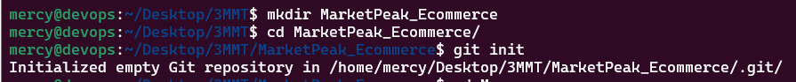
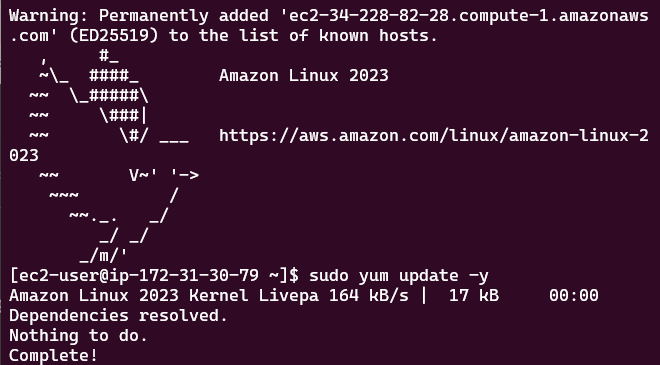
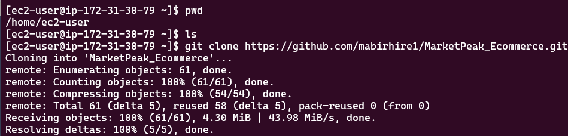
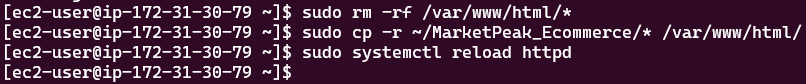
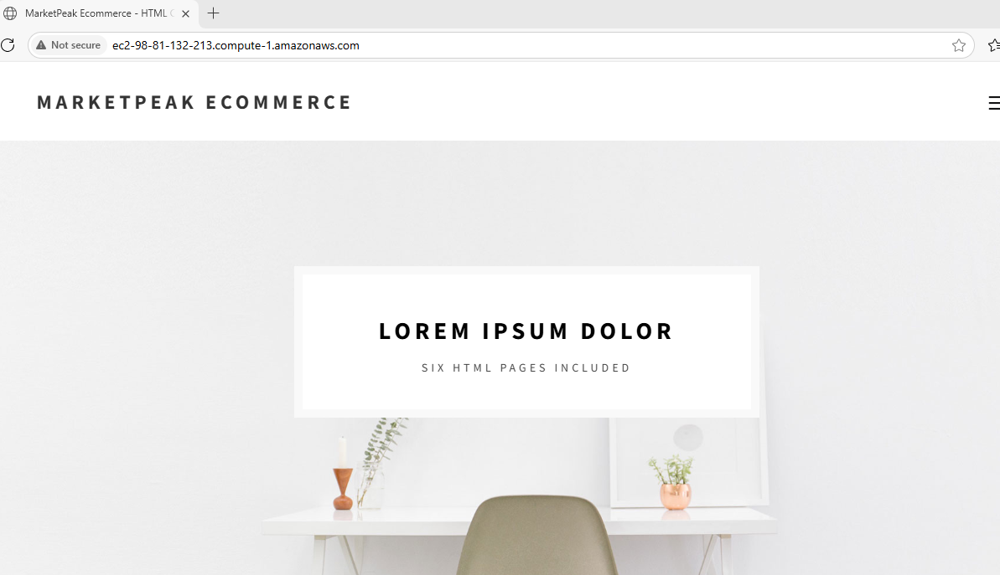
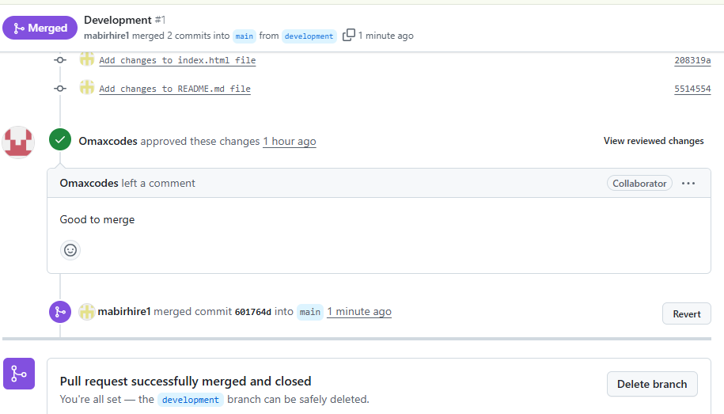
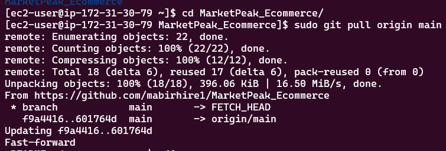
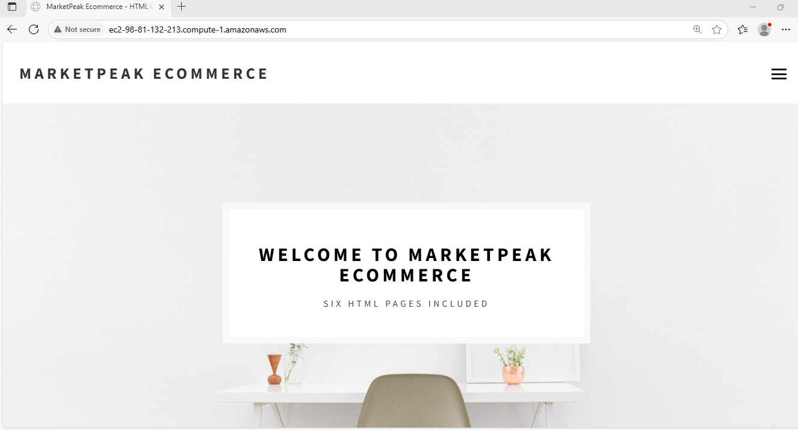

# MarketPeak Ecommerce Website

This project downloads a free e-commerce website for a new marketplace named "MarketPeak" from https://www.tooplate.com/view/2082-pure-mix. Using Git as a version control the platform will be developed on a Linux environment and deployed on an AWS EC2 instance.

## 1. Implement Version Control with Git

**1.1 Initialise Git Repository:**

Create MarketPeak Ecommerce Folder and initialise Git.

**1.2 Download the template:**

Download the specific template of choice and customize.

**1.3 Stage and Commit the Template to GitHub:**

Stage and commit the files to GitHub repository.

## 2. Aws Deployment:

Setup an Amazon EC2 instance to deploy MarketPeak_Ecommerce platform.

**2.1 Set Up an AWS EC2 instance**

* Log in to AWS Management Console, Launch an EC2 instance using Amazon Linux AMI, and Connect to the instance using SSH.

**2.2 Clone the Repository on the Linux Server**

* Install git, clone the Repository to the EC2 instance using HTTPS or SSH.

**2.3 Configure httpd for Website**

* Clear the default httpd web directory, copy the MarketPeak Ecommerce files to it and reload the httpd service.

**2.4 Access Website from Browser**

* Open a web browser and access the public IP of your EC2 instance to view the deployed website.

## Continuous  Integration and Deployment Workflow

This covers how changes are made in a development environment, Using Git version control and the deployment of updates to your production server on AWS.

**3.1 Developing New Features and Fixes**

* Create development branch and implement changes/fix bugs on your website. 

* Push development branch to GitHub, Create Pull Request, Review and Merge.

**3.2 Deploying Updates to the Production Server**

* SSH into your AWS EC2 instance where the production server is hosted. Navigate to the website's directory and pull the latest changes fro the main branch. Reload the server.

**3.3 Updated MarketPeak Ecommerce Website**

* Access the website to confirm if the changes/fixes where effected.

## Challenges and Fixes

1. Challenge: Permission denied (publickey) when SSHing to EC2 instance

Problem: The SSH client on your local machine is unable to authenticate with the EC2 server using the provided SSH key. This is usually due to incorrect permissions on the private key file or the wrong key being used for the instance.

Fixes:

Most Common: Set correct permissions on your private key file (.pem file) on your local machine: chmod 400 key.pem.

Verify Key Pair: Ensure the .pem file you're using is the exact private key associated with the specific EC2 instance in the AWS console.

Correct User: Confirm you're using the correct default user for your EC2 instance (e.g., ubuntu for Ubuntu AMIs).

SSH Agent (Optional): Use ssh-agent to manage keys: eval "$(ssh-agent -s)" then ssh-add key.pem.

2. Challenge: Git ! [rejected] main -> main (fetch first) error on git push

Problem: Your local Git branch is behind the remote branch on GitHub. Someone else (or you from another location) pushed changes to the remote since your last git pull. Git rejects your push to prevent overwriting remote work.

Fix: Synchronize your local repository first:

git fetch origin (downloads remote changes).

git pull origin main (merges remote main into your local main).

Resolve any merge conflicts manually if they occur.

git push origin main (push your changes after integration).

3. Challenge: Git prompts for a merge commit message after git pull

Problem: Git automatically opens an editor (like vim or nano) to ask for a commit message for the merge commit that git pull (specifically, git merge) created.

Fix: Accept the default message (which is usually sufficient) or add a brief custom explanation. Then, save and exit the editor (e.g., Ctrl+O, Enter, Ctrl+X for nano; Esc, :wq, Enter for vim).

4. Challenge: 404 - page not found for an image path like images%5Creadme-img.png on GitHub

Problem: A markdown file (like README.md) is referencing an image using Windows-style backslashes (\) in the path, but GitHub (which uses Linux/Unix file systems) expects forward slashes (/). The backslash gets URL-encoded as %5C.

Fix: Edit the markdown file, change all backslashes (\) in image paths to forward slashes (/), commit the change, and push to GitHub.