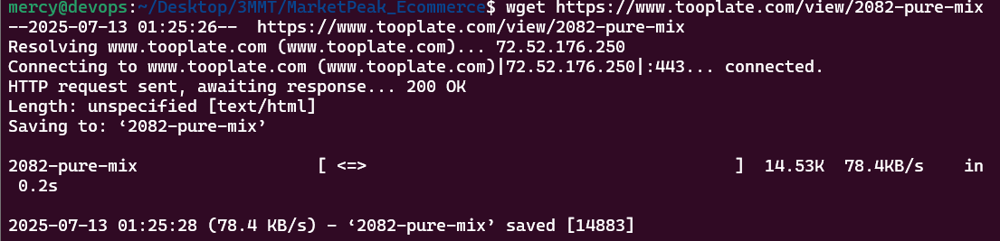
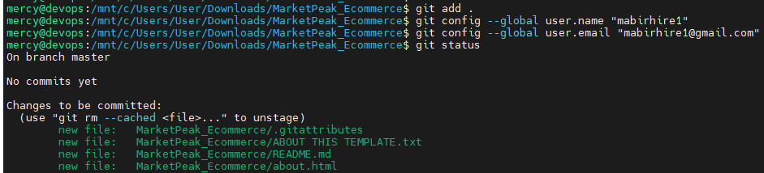

# MarketPeak_Ecommerce

# MarketPeak-Ecommerce Website

This project downloads a free e-commerce website for a new marketplace named "MarketPeak" from https://www.tooplate.com/view/2082-pure-mix. Using Git as a version control the platform will be developed on a Linux environment and deployed on an AWS EC2 instance.

## 1. Implement Version Control with Git

**1.1 Initialise Git Repository:**

Create MarketPeak Ecommerce Folder and initialise Git.

**1.2 Download the template:**

Download the specific template of choice and customize.

**1.3 Stage and Commit the Template to GitHub:**

Stage and commit the files to GitHub repository.

## 2. Aws Deployment:

Setup an Amazon EC2 instance to deploy MarketPeak_Ecommerce platform.

**2.1 Set Up an AWS EC2 instance**

* Log in to AWS Management Console, Launch an EC2 instance using Amazon Linux AMI, and Connect to the instance using SSH.

**2.2 Clone the Repository on the Linux Server**

* Install git, clone the Repository to the EC2 instance using HTTPS or SSH.

**2.3 Configure httpd for Website**

* Clearing the default httpd web directory, copy the MarketPeak Ecommerce files to it and reload the httpd service.

**2.4 Access Website from Browser**

* Open a web browser and access the public IP of your EC2 instance to view the deployed website.

## Continuous  Integration and Deployment Workflow

This covers how changes are made in a development environment, Using Git version control and the deployment of updates to your production server on AWS.

**3.1 Developing New Features and Fixes**

* Create development branch and implement changes/fix bugs on your website.  
